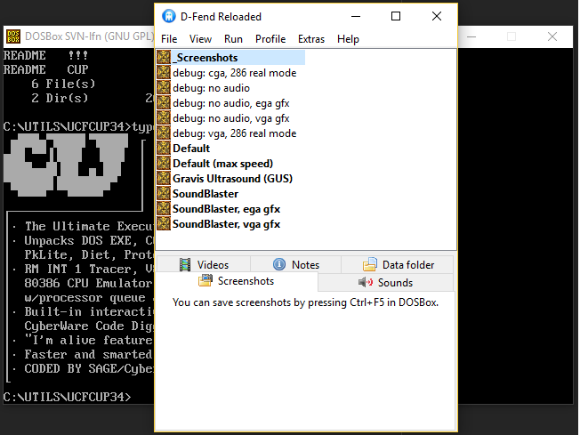

# Defacto2's DOSBox toolkit

A self-contained emulation package that we use to capture screenshots and troubleshoot [MS-DOS](https://en.wikipedia.org/wiki/MS-DOS) software and programs offered for [download on the website](https://defacto2.net/file/list?output=card&platform=dos&section=-&sort=posted_desc&perpage=100).

The package comprises of [D-Fend](http://dfendreloaded.sourceforge.net/), [DOSBox SVN-lfn](https://www.dosbox.com/wiki/SVN_Builds), custom D-Fend `Confs` and a selection of DOS tools and utilities.

#### Install

Unfortunately only for Windows.

Option 1 - Zip download

1. Select **Download ZIP** from the green **Clone or download** button on the [GitHub repository](https://github.com/Defacto2/defacto2-dosbox). 
2. Extract the downloaded zip into a directory of your choice.
3. Open the directory and run `DFend.exe`.

Option 2 - Git clone

1. Open an administrator command prompt and `cd` to a directory where you want to install.
2. `git clone https://github.com/Defacto2/defacto2-dosbox.git`
3. `defacto2-dosbox\dfend.exe`

#### Profiles

Most of the D-Fend profiles should be self-explanatory for anyone familiar with DOS. Generally **Default** or **Default (max speed)** should work for most *scene* programs. Some programs have buggy audio detection routines and with those you're best to drill down to either one of the *SoundBlaster* or the *Gravis Ultrasound* profiles, instead of using the *Defaults* that have multiple soundcards.

The *debug:* profiles are mostly to troubleshoot in case the DOS software has incompatibility issues with certain hardware. Some demos work better with *VGA* instead of the *Default*'s *SVGA*. Others need all the audio emulation disabled to work correctly.

#### VirtualHD

The D-Fend VirtualHD (virtual `C:` drive) has a number of DOS tools and utilities.

Please note while D-Fend, DOSBox and the configurations are released under a GPL-3.0 licence. The files within `VirtualHD` are probably not, and should be considered proprietary unless they state otherwise.

######Archive decompression utilities
`7ZIP` `ARC` `ARJ` `DOSZIP` `LHA` `PKARC` `PKZIP*` `RAR` `UCFCUP34` `ZOO`

######Operating systems
`FREEDOS`

######Backup startup configurations
`AUTOEXEC`

######ACiDView (ansi, text, nfo reader)
`AVD-436`

######Software patches and fixes
`TP-FIX` `UNP411`

######Gravis Ultrasound Patches
`ULTRASND`

